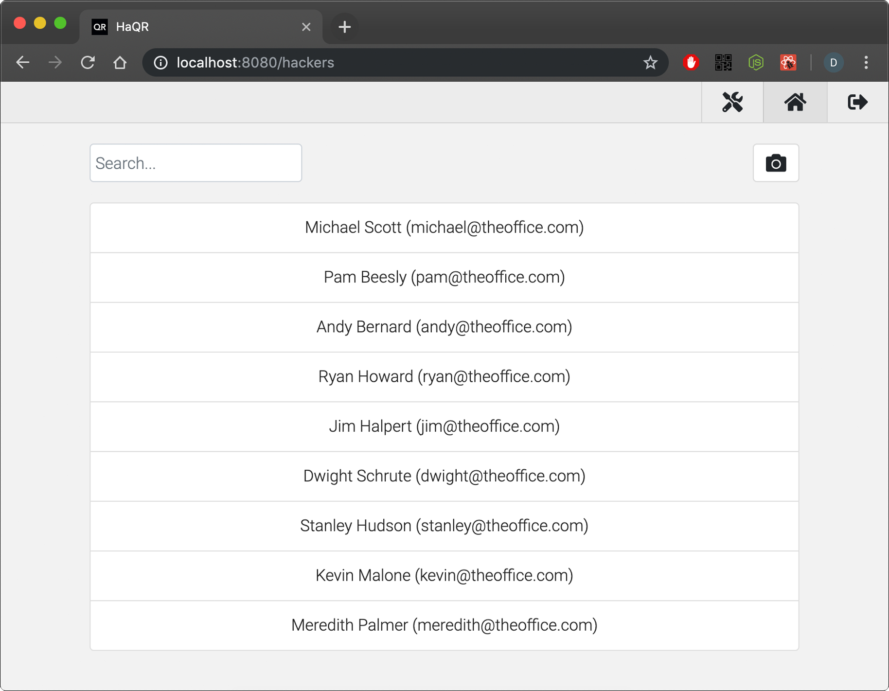
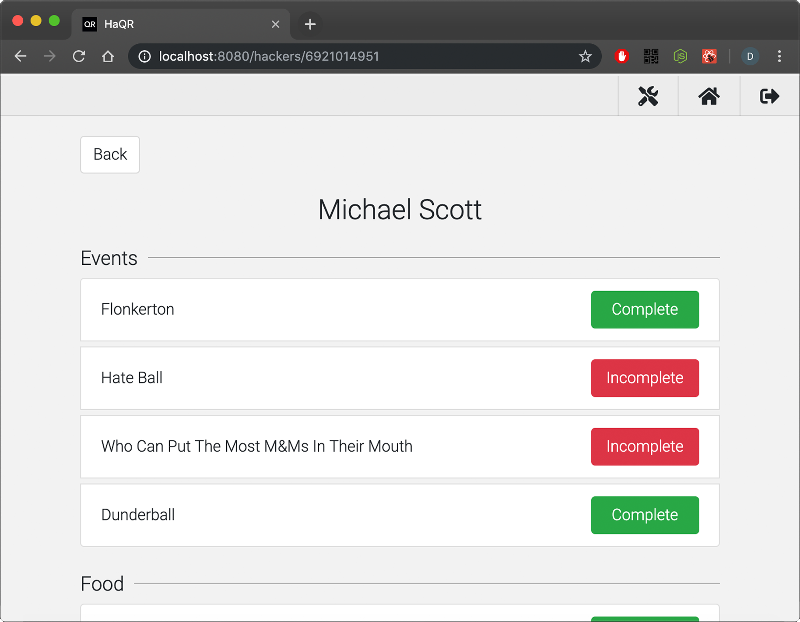
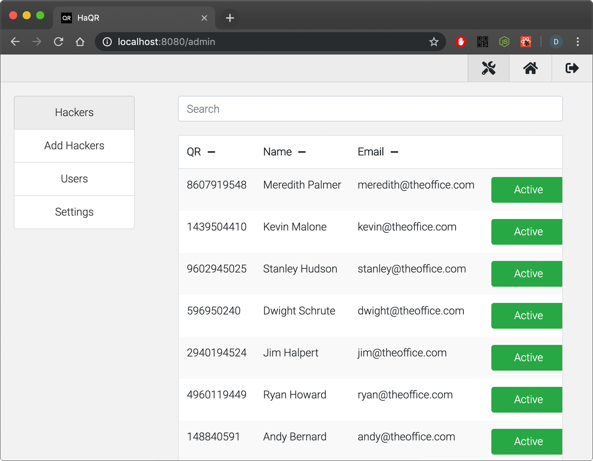

# HaQR
A modular QR system for hackathon and event management



## What is this?
HaQR is a QR management system built specifically for the [BoilerMake](https://www.boilermake.org/) hackathon.

Using it, the BoilerMake team is able to use QR codes on our hackers' badges to keep track of what swag and meals they've gotten.

Though HaQR is a web app, it has been designed to work on devices of any size meaning you can take your HaQR deployment with you anywhere you go.

## Features

#### Hackers


See and interact with the attendees at your event!

Open individual hacker pages by either clicking on a hacker or by scanning a QR code by clicking on the camera button at the top right of the page.

#### Hacker


View and toggle the fields for a specific hacker.

#### Admin


Manage the hackers and users in your application.

Through the admin page, users can toggle hackers active or inactive, add new hackers, and authorize or promote users.

## Quickstart

#### Heroku
Deploy the application to production in minutes with Heroku

[](https://heroku.com/deploy?template=https://github.com/drewthoennes/HaQR/tree/master)

In order to deploy, make sure you create a [GitHub OAuth application](https://github.com/settings/applications) for your HaQR instance.

#### Local development
To run the application locally, install and start MongoDB and then run:

```bash
npm install
npm start
```