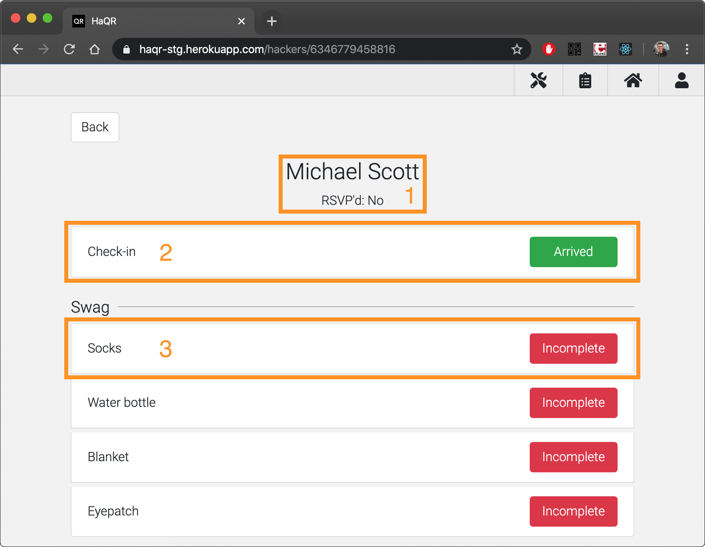

# HaQR
A modular QR system for hackathon and event management


## What is this?
HaQR is a QR management system built specifically for the [BoilerMake](https://www.boilermake.wtf/) hackathon.

Using it, the BoilerMake team is able to use QR codes on our hackers' badges to keep track of what swag and meals they've gotten.

Though HaQR is a web app, it has been designed to work on devices of any size meaning you can take your HaQR deployment with you anywhere you go.

## Features

#### Hackers


##### 1 List of active hackers
See a list of active hackers that you can scan fields for!

Clicking on a hacker opens up a page with that hacker's fields for you to toggle.

##### 2 Open camera to scan hacker's QR code
Clicking this button uses your device's camera to scan a QR code belonging to a hacker. Once scanned, that hacker's page will open for you to toggle their fields.

The QR codes are just strings associated with each hacker that admins define when adding new hackers.

##### 3 Select field for quick scan
This dropdown has a list of all fields any of the active hackers currently have.

Selecting a field and then scanning a hacker's QR code automatically toggles that field, saving you time and ensuring consistency across multiple scans.

#### Hacker


##### 1 Hacker information
The details for this hacker, including the hacker's name and notes that admins can include when creating the hacker.

##### 2 Hacker check-in
A field specifically meant for use during check-in. This is an optional field that can be toggled by admins when adding the hacker.

There is also a setting that will activate hackers (make them visible in the hackers list) on check-in, making it easy to quickly see who is at your event.

##### 3 Hacker fields
Individual fields grouped by a field name. These can be toggled by both organizers and admins.

#### Admins


Manage the hackers, users, and roles in your application.

There are various admin pages accessed by the toolbar to the right. Through these pages, admins can toggle hackers active or inactive, add new hackers, authorize or promote users, add or delete roles, and access the application settings.

#### Hacker Roles


When admins create a hacker, they have to associate the hacker with a role. These roles define the fields that can be toggled and help group the attendees.

## Quickstart

#### Heroku
Deploy the application to production in minutes with Heroku!

[](https://heroku.com/deploy?template=https://github.com/drewthoennes/HaQR/tree/master)

In order to deploy, make sure you create a [GitHub OAuth application](https://github.com/settings/applications) for your HaQR instance. The homepage URL is just the ROOT_URL environment variable and the callback URL is ```{ROOT_URL}/api/auth/github/redirect```.

#### Local development
To run the application locally, install and start MongoDB and then run:

```bash
npm install
npm start-dev
```
